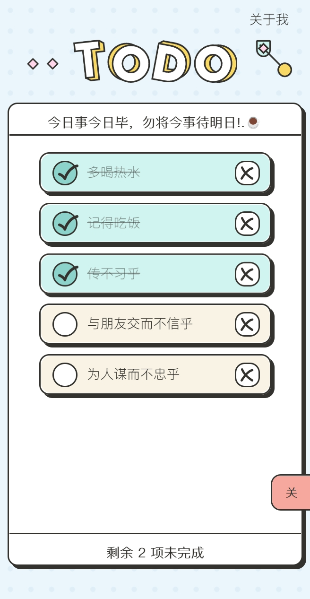
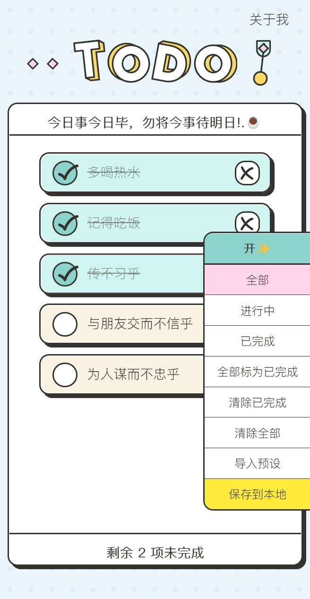
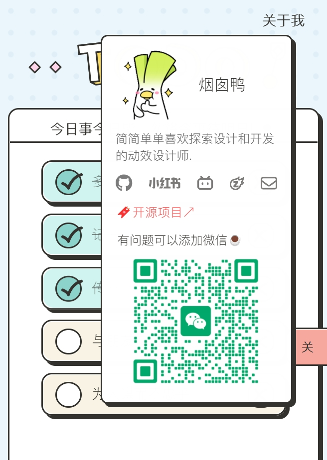
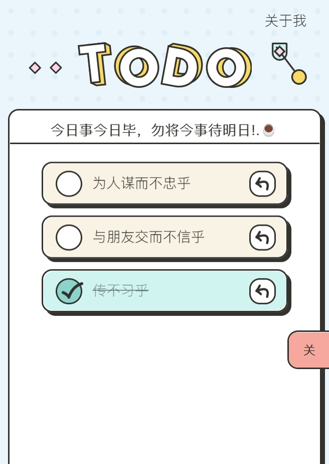
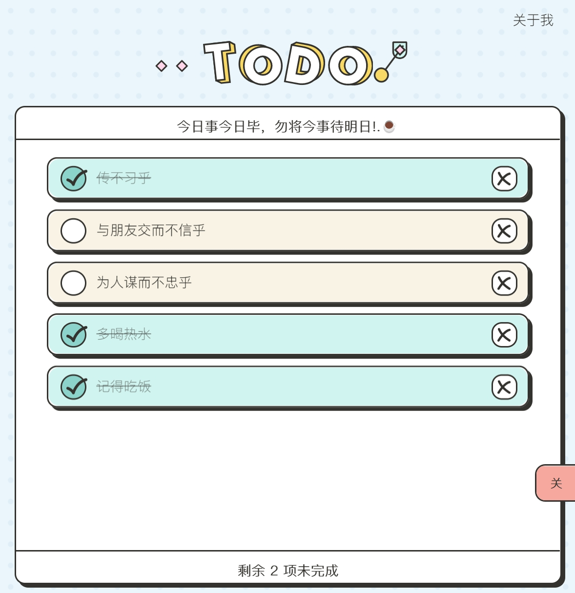
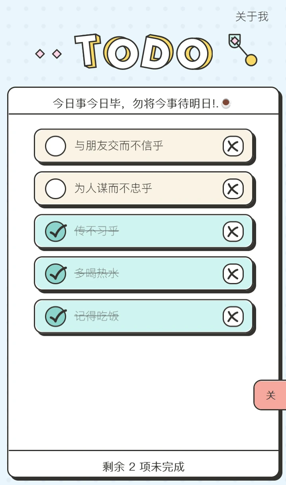
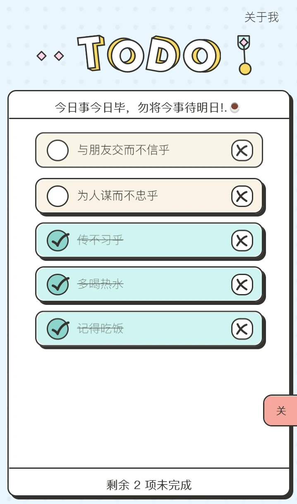
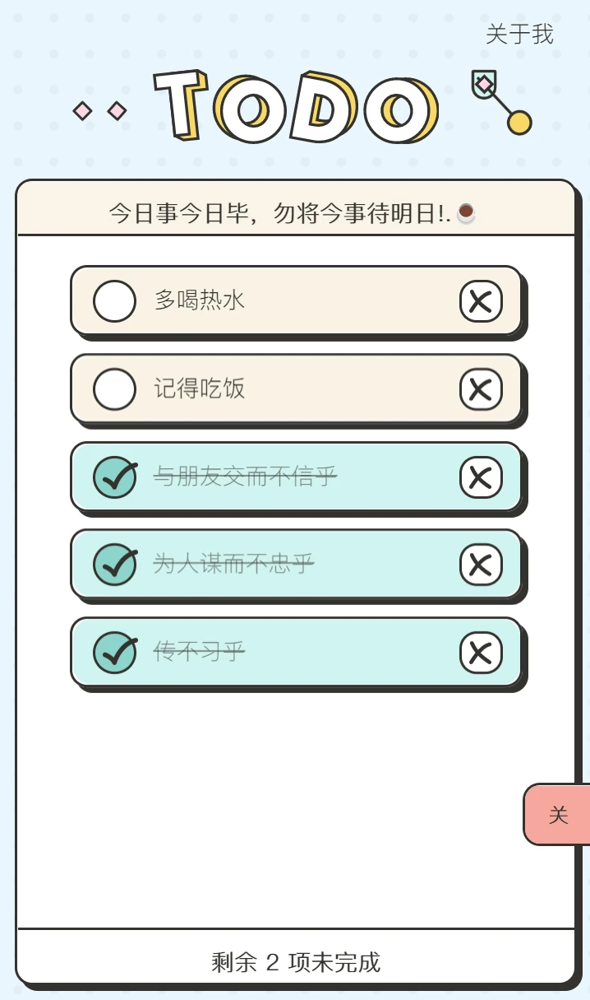

# UINeed Todo AE - Documentation Site

English | [简体中文](README.md)

<div align="center">
  
  <h3>Professional Todo Extension for Adobe After Effects Designers</h3>

  <p>
    <a href="https://todo.itycon.cn/">📖 Documentation</a> •
    <a href="https://todo.xn--jcs561df75a.space/">🚀 Live Demo</a> •
    <a href="https://github.com/yancongya/Uiineed-Todo-List-For-AE">💻 Extension Source</a>
  </p>

  <p>
    
    
    
    
  </p>
</div>

---

> **Original Author**: [@Rico's Design Thinking](https://www.xiaohongshu.com/user/profile/5f2b6903000000000101f51f) | [Original Project](https://github.com/ricocc/uiineed-todo-list)

This is the official documentation site for **UINeed Todo AE Extension**, built with VitePress. This project provides professional todo management solutions for Adobe After Effects designers, featuring smooth animations and local data storage.

## 🌐 Online Access

### Documentation Site
- **Main Site**: [https://todo.itycon.cn/](https://todo.itycon.cn/)
- **GitHub Pages**: [https://yancongya.github.io/Uiineed-Todo-List-For-AE-Docs/](https://yancongya.github.io/Uiineed-Todo-List-For-AE-Docs/)

### Live Demo
- **Demo Site**: [https://todo.xn--jcs561df75a.space/](https://todo.xn--jcs561df75a.space/)
- **GitHub Pages**: [https://yancongya.github.io/Uiineed-Todo-List-For-AE/](https://yancongya.github.io/Uiineed-Todo-List-For-AE/)

### Notes

- 📖 **Documentation Site** provides complete user guides and development documentation
- 🚀 **Live Demo** allows direct experience of extension features, but cannot perform AE-specific operations
- 💾 Online version data uses browser localStorage, cannot sync across different devices
- 🔧 For full functionality, please download and install the AE extension version

## 📸 Interface Preview

<div align="center">
  <div style="overflow-x: auto; white-space: nowrap; padding: 10px 0;">
    
    
    
    
    
  </div>
</div>

## 📖 Project Background

There are various to-do list applications in the market, but few are tailored specifically for AE designers. This project aims to create:

- A clean, beautiful to-do list management tool without unnecessary features
- Seamless integration with Adobe After Effects
- Optimization based on Adobe After Effects usage logic
- Smooth interface animations
- Local data storage to ensure work is not lost
- Multi-project management for easy organization
- Task priority settings
- Support for task notes and tags

The visual design references Figma community member aakarshna's Noted design specifications, with optimizations for AE workflows. The technical implementation uses Vue 2.x combined with Adobe CEP extension framework, allowing designers to efficiently manage tasks within the AE environment.

## 🚀 Features

- 🎬 Specifically redesigned for AE
- ✨ Smooth UI interactions
- 📝 Create, edit, complete, and delete to-do items
- 🔗 Drag and drop to-do items for reordering
- 🔄 Integration with AE projects for direct use within AE
- 💾 Local storage, export and import data without losing data presets

## 💡 Usage

### Installation Steps

After installing as an AE extension, it can be opened directly in AE:

1. Place the folder in the AE extension directory:
   - Windows: `C:\Program Files (x86)\Common Files\Adobe\CEP\extensions`
   - macOS: `/Library/Application Support/Adobe/CEP/extensions`
2. First-time installation requires enabling CEP extension debug mode:
   - Windows: Run as administrator `REG ADD HKEY_CURRENT_USER\Software\Adobe\CSXS.11 /v PlayerDebugMode /t REG_STRING /d 1`
   - macOS: Terminal command `defaults write com.adobe.CSXS.11 PlayerDebugMode 1`
3. Restart AE, then open from the "Window > Extensions" menu
4. You can also open the HTML file directly for standalone use

### Shortcut Operations

- ✅ Click the title to create a task
- ✏️ Double-click a to-do item or slogan to edit
- ↕️ Drag and drop to-do items to sort
- 🔍 Right panel provides quick filtering and data viewing

### Data Management

- All data is saved in the todo.list file in the local uiineed-todo-list folder, no privacy concerns
- Support for importing/exporting task lists for backup and migration
- Recommended regular auto-save to prevent data loss
- Support for project-based task management

## 💻 Technology Stack

- Vue 2.x (CDN import)
- HTML/CSS/JavaScript
- Adobe CEP extension framework
- ExtendScript with AE integration
- Local storage (localStorage)
- Vuex state management
- Vue-draggable for drag functionality
- Vue-transitions for transition animations

## 🎬 Operation Demo

<div align="center">
  <div style="overflow-x: auto; white-space: nowrap; padding: 10px 0;">
    <div style="display: inline-block; margin-right: 20px; vertical-align: top; min-width: 300px;">
      
      <p style="color: #666; font-size: 14px; text-align: center; margin: 0;">Create Task</p>
    </div>

<div style="display: inline-block; margin-right: 20px; vertical-align: top; min-width: 300px;">
  
  <p style="color: #666; font-size: 14px; text-align: center; margin: 0;">Task Adjustment</p>
</div>

<div style="display: inline-block; vertical-align: top; min-width: 300px;">
  
  <p style="color: #666; font-size: 14px; text-align: center; margin: 0;">Edit Name</p>
</div>
</div>
</div>


## 📄 License

This project is open-source under the MIT license. See the [LICENSE](./LICENSE) file for details.

## 🤝 Contribution Guidelines

Contributions and suggestions are welcome!

1. Fork this repository
2. Create your feature branch (`git checkout -b feature/AmazingFeature`)
3. Commit your changes (`git commit -m 'Add some AmazingFeature'`)
4. Push to the branch (`git push origin feature/AmazingFeature`)
5. Open a Pull Request

## 💰 Support the Author

Development takes time and effort. If this project helps you, please consider supporting me!

<div align="center">
  
  <p style="margin-top: 10px;">You can also support me via <a href="https://afdian.tv/a/tycon" target="_blank">Afdian</a> platform</p>
</div>

## ❗ Notes

- Restart AE after first installation for normal use
- Default values are temporarily saved; click "Save to Local" to avoid data loss after restarting AE
- Regular data export backups recommended
- If the extension fails to load, check if CEP debug mode is enabled
- Network synchronization not currently supported
- Large numbers of tasks may affect performance, archive appropriately

## 🛠️ Local Development

### Requirements

- **Node.js** 16.0 or higher
- **npm** or **yarn** package manager
- **Git** version control tool

### Quick Start

```bash
# Clone repository
git clone https://github.com/yancongya/Uiineed-Todo-List-For-AE-Docs.git

# Enter project directory
cd Uiineed-Todo-List-For-AE-Docs

# Install dependencies
npm install

# Start development server
npm run docs:dev

# Build for production
npm run docs:build

# Preview build result
npm run docs:preview
```

### Project Structure

```
Uiineed-Todo-List-For-AE-Docs/
├── .vitepress/           # VitePress configuration
│   ├── config.js         # Site configuration
│   └── theme/            # Custom theme
├── guide/                # Guide documentation
├── features/             # Feature documentation
├── development/          # Development documentation
├── public/               # Static assets
│   ├── img/              # Image resources
│   └── js/               # JavaScript files
├── index.md              # Homepage
└── package.json          # Project configuration
```