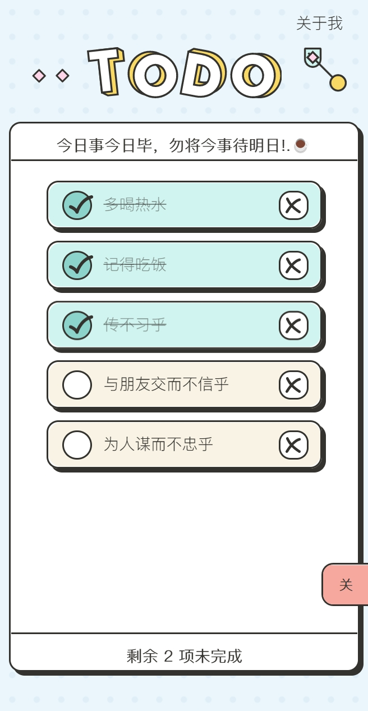
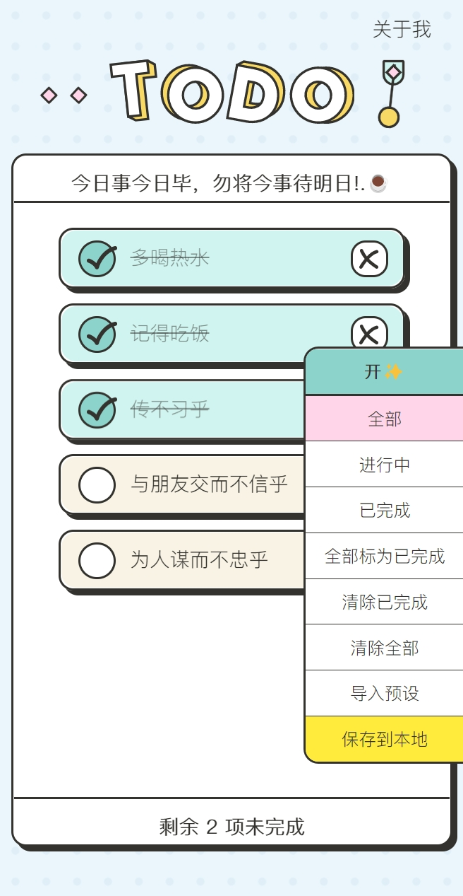
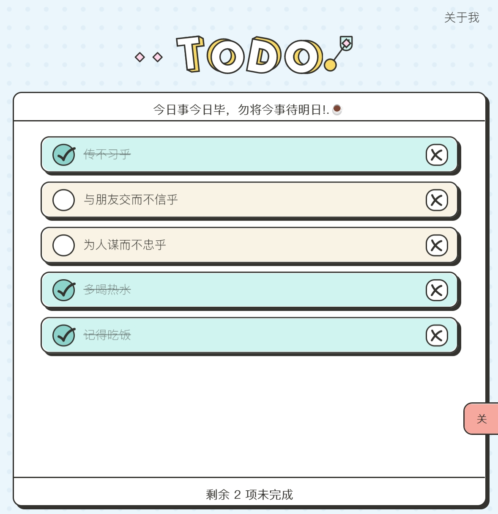
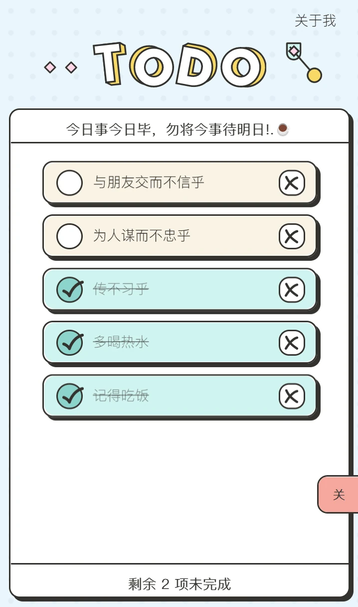
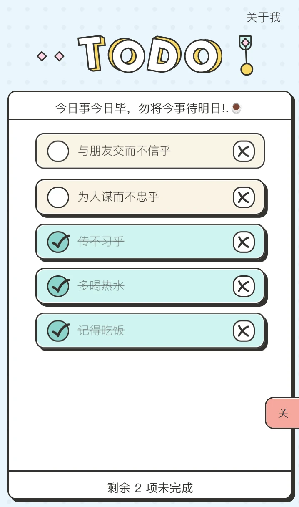
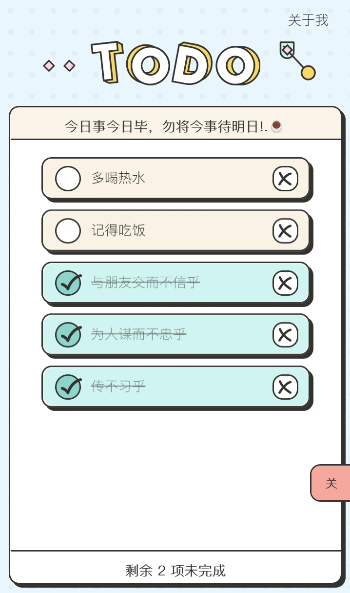

# UINeed Todo AE - 文档站点

[English](README.en.md) | 简体中文

<div align="center">
  
  <h3>专为Adobe After Effects设计师打造的待办事项扩展</h3>

  <p>
    <a href="https://todo.itycon.cn/">📖 在线文档</a> •
    <a href="https://todo.xn--jcs561df75a.space/">🚀 在线演示</a> •
    <a href="https://github.com/yancongya/Uiineed-Todo-List-For-AE-Extension">💻 扩展源码</a>
  </p>

  <p>
    
    
    
    
  </p>
</div>

---

> **原创作者**：[@Rico的设计漫想](https://www.xiaohongshu.com/user/profile/5f2b6903000000000101f51f) | [原项目地址](https://github.com/ricocc/uiineed-todo-list)

这是 **UINeed Todo AE 扩展** 的官方文档站点，基于 VitePress 构建。本项目为Adobe After Effects设计师提供专业的待办事项管理解决方案，支持流畅动效和本地数据存储。

## 🌐 在线访问

### 文档站点
- **主站点**: [https://todo.itycon.cn/](https://todo.itycon.cn/)
- **GitHub Pages**: [https://yancongya.github.io/Uiineed-Todo-List-For-AE-Docs/](https://yancongya.github.io/Uiineed-Todo-List-For-AE-Docs/)

### 在线演示
- **演示站点**: [https://todo.xn--jcs561df75a.space/](https://todo.xn--jcs561df75a.space/)
- **GitHub Pages**: [https://yancongya.github.io/Uiineed-Todo-List-For-AE/](https://yancongya.github.io/Uiineed-Todo-List-For-AE/)

### 注意事项

- 📖 **文档站点** 提供完整的使用指南和开发文档
- 🚀 **在线演示** 可以直接体验扩展功能，但无法进行AE特有操作
- 💾 在线版本数据使用浏览器localStorage存储，不同设备无法同步
- 🔧 完整功能请下载并安装AE扩展版本

## 📸 扩展界面预览

<div align="center">
  <div style="overflow-x: auto; white-space: nowrap; padding: 10px 0;">
    
    
    
    
    
  </div>
</div>

## 📖 项目背景

市面上有各种各样的待办事项应用，但很少有专为AE设计师量身定制的工具，偶尔看到有个开源的todo项目，于是考虑移植到AE中。本项目旨在创建一个：

- 简洁美观，没有多余功能的待办事项管理工具
- 与Adobe After Effects无缝集成
- 针对Adobe After Effects使用逻辑进行优化
- 提供流畅的界面动效
- 支持本地数据存储，确保工作不丢失
- 支持多项目管理，便于分类整理
- 支持任务优先级设置
- 支持任务备注和标签

在视觉设计上，参考了Figma社区aakarshna的Noted设计规范，并根据AE工作流进行了优化调整。技术实现上使用Vue 2.x结合Adobe CEP扩展框架，让设计师能在AE环境中高效管理任务。

## 🚀 特性

- 🎬 专为AE进行重新适配
- ✨ 流畅的UI交互动效
- 📝 创建、编辑、完成、删除待办事项
- 🔗 可拖拽进行任务排序
- 🔄 与AE项目集成，可直接AE中使用
- 💾 本地存储保存、导出导入数据，不丢失数据预设

## 💡 使用方法

### 安装步骤

直接下载

作为AE扩展安装后，可在AE中直接打开并使用：

1. 将文件夹放入AE扩展目录：
   - Windows: `C:\Program Files (x86)\Common Files\Adobe\CEP\extensions`
   - macOS: `/Library/Application Support/Adobe/CEP/extensions`
2. 首次安装需要开启CEP扩展调试模式：
   - Windows: 以管理员身份运行命令 `REG ADD HKEY_CURRENT_USER\Software\Adobe\CSXS.11 /v PlayerDebugMode /t REG_STRING /d 1`
   - macOS: 终端运行命令 `defaults write com.adobe.CSXS.11 PlayerDebugMode 1`
3. 重启AE后，在"窗口 > 扩展"菜单中打开
4. 也可直接打开HTML文件进行独立使用

### 快捷操作

- ✅ 点击标题创建任务
- ✏️ 双击待办事项或slogan可编辑
- ↕️ 拖拽待办事项可排序
- 🔍 右侧面板提供快捷筛选功能和数据查看

### 数据管理

- 所有数据保存在本地文档uiineed-todo-list文件夹内的todo.list文件，无需担心隐私问题
- 支持导入/导出任务列表，方便备份和迁移
- 建议定期自动保存，防止数据丢失
- 支持按项目分类管理任务

## 💻 技术栈

- Vue 2.x (CDN引入)
- HTML/CSS/JavaScript
- Adobe CEP扩展框架
- ExtendScript与AE集成
- 本地存储 (localStorage)
- Vuex 状态管理
- Vue-draggable 拖拽功能
- Vue-transitions 过渡动画

## 🎬 操作演示

<div align="center">
  <div style="overflow-x: auto; white-space: nowrap; padding: 10px 0;">
    <div style="display: inline-block; margin-right: 20px; vertical-align: top; min-width: 300px;">
      
      <p style="color: #666; font-size: 14px; text-align: center; margin: 0;">创建任务</p>
    </div>

<div style="display: inline-block; margin-right: 20px; vertical-align: top; min-width: 300px;">
  
  <p style="color: #666; font-size: 14px; text-align: center; margin: 0;">任务调整</p>
</div>

<div style="display: inline-block; margin-right: 20px; vertical-align: top; min-width: 300px;">
  
  <p style="color: #666; font-size: 14px; text-align: center; margin: 0;">自适应操作</p>
</div>

<div style="display: inline-block; vertical-align: top; min-width: 300px;">
  
  <p style="color: #666; font-size: 14px; text-align: center; margin: 0;">修改名字</p>
</div>
</div>
</div>

## 📄 许可证

本项目基于 MIT 许可证开源。详情请查看 [LICENSE](./LICENSE) 文件。

## 🤝 贡献指南

欢迎贡献代码或提出建议！

1. Fork 本仓库
2. 创建您的特性分支 (`git checkout -b feature/AmazingFeature`)
3. 提交您的更改 (`git commit -m 'Add some AmazingFeature'`)
4. 推送到分支 (`git push origin feature/AmazingFeature`)
5. 打开一个 Pull Request

## 💰 支持作者

制作不易，如果这个项目对你有帮助，可以考虑支持一下我~

<div align="center">
  
</div>

## ❗ 注意事项

- 首次安装后需要重启AE才能正常使用
- 数据默认值临时保存，建议点击保存到本地，避免重启AE后数据丢失
- 建议定期导出数据备份
- 如遇到扩展无法加载，请检查CEP调试模式是否开启
- 暂不支持网络同步功能
- 大量任务可能会影响性能，建议适时归档

## 🛠️ 本地开发

### 环境要求

- **Node.js** 16.0 或更高版本
- **npm** 或 **yarn** 包管理器
- **Git** 版本控制工具

### 快速开始

```bash
# 克隆仓库
git clone https://github.com/yancongya/Uiineed-Todo-List-For-AE-Docs.git

# 进入项目目录
cd Uiineed-Todo-List-For-AE-Docs

# 安装依赖
npm install

# 启动开发服务器
npm run docs:dev

# 构建生产版本
npm run docs:build

# 预览构建结果
npm run docs:preview
```

### 项目结构

```
Uiineed-Todo-List-For-AE/
├── .vitepress/           # VitePress 配置
│   ├── config.js         # 站点配置
│   └── theme/            # 自定义主题
├── guide/                # 指南文档
├── features/             # 功能特性
├── development/          # 开发文档
├── public/               # 静态资源
│   ├── img/              # 图片资源
│   └── js/               # JavaScript 文件
├── index.md              # 首页
└── package.json          # 项目配置
```

